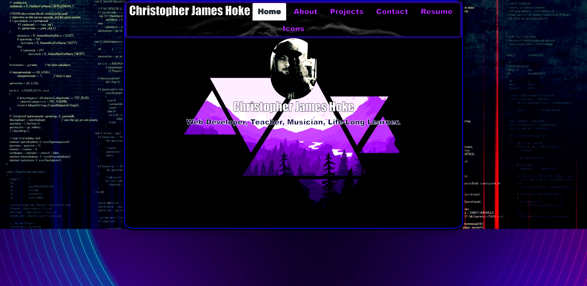

# Reactfolio v1.0.0
  ## Badge
  
  ## Description 
  A portfolio built using react and other packages listed in package.json
  ## Table of contents
  - [Installation](#Installation)
  - [Usage](#Usage)
  - [License](#License)
  - [Contributions](#Contributions)
  - [Testing](#Testing)
  - [Repository Link](#Repository)
  - [GitHub Info](#GitHub) 
  ## Installation
  download package.json and other files and run npm i in terminal, npm run start to start react server locally. node server.js to run email server
  ## Usage
  Serves as a portfolio containing projects/resume/contact/about/icons for socials. 
  ## License
  
  ## Contributions
  Christopher Hoke AKA James Primitive
  ## Testing
  Test by downloading files, installing npm i via package.json, and running npm run start. 
  ## Repository
  https://github.com/PrimitiveJ/Reactfolio-v-1.0.0
  ## GitHub
  PrimitiveJ
  ## Contact
  hokecj@gmail.com
  This README.md was generated using READLEMETHIS.
  ##Screenshot
  
